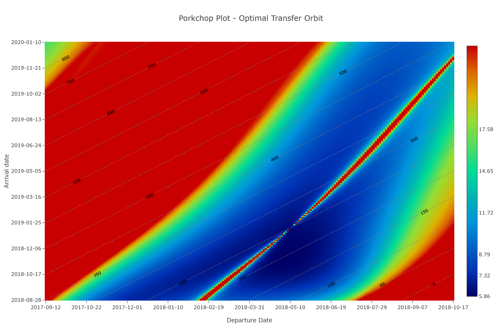
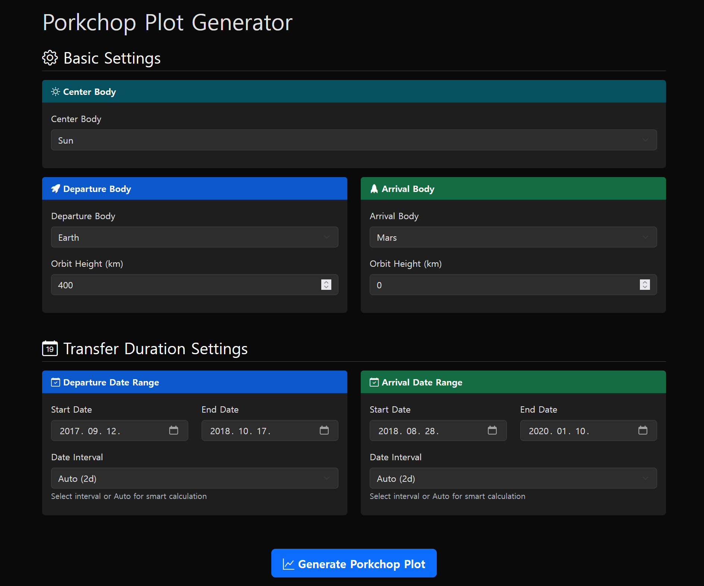

# Porkchop Plot Generator
This project provides a web-based Porkchop Plot generator designed for interplanetary mission planning. 
The service utilizes WebAssembly (WASM) compiled from C++ to efficiently solve Lambert's problem in the browser. 
It is supported by a Node.js backend that retrieves ephemeris data from NASA JPL Horizons and delivers it to the frontend.


## Key Features
- **WebAssembly Solver**: High-performance C++ Lambert solver optimized with WASM SIMD.
- **Backend Integration**: Node.js server for fetching accurate celestial body data from the JPL Horizons system.
- **Accurate Computation**: Implements the Battin-Vaughan Lambert algorithm for trajectory calculation.

## Technical References

- R. H. Battin and R. M. Vaughan, "An elegant lambert algorithm," *Journal of Guidance, Control, and Dynamics*, vol. 7, no. 6, pp. 662–670, 1984.
- Portions of the implementation are adapted with reference to [jorgepiloto/lamberthub](https://github.com/jorgepiloto/lamberthub).

## Usage

The frontend allows users to select departure and arrival windows, and generates the corresponding Porkchop Plot by solving Lambert’s problem for various launch and arrival date pairs. 
The solution space is visualized, enabling optimal trajectory selection based on mission constraints such as delta-v.


## Installation
To run the Porkchop Plot Generator locally using Docker:

1. Download the following files
```bash
curl -O https://raw.githubusercontent.com/hydrogendeuteride/lambert/main/Dockerfile
curl -O https://raw.githubusercontent.com/hydrogendeuteride/lambert/main/docker-compose.yml
curl -O https://raw.githubusercontent.com/hydrogendeuteride/lambert/main/env.example
```
2. Create a `.env` file based on `env.example` and adjust the environment variables as needed.
```bash
mv .env.example .env
```
3. Build and start containers:

```bash
docker compose up --build
```
4. The application will be available at ```http://localhost:[PORT]```, where ```[PORT]``` is specified in your .env file.

## License

This project is licensed under the GNU General Public License v3.0 (GPLv3).
See the [LICENSE](./LICENSE) file for details.

This project is based in part on [jorgepiloto/lamberthub](https://github.com/jorgepiloto/lamberthub), licensed under GPLv3.